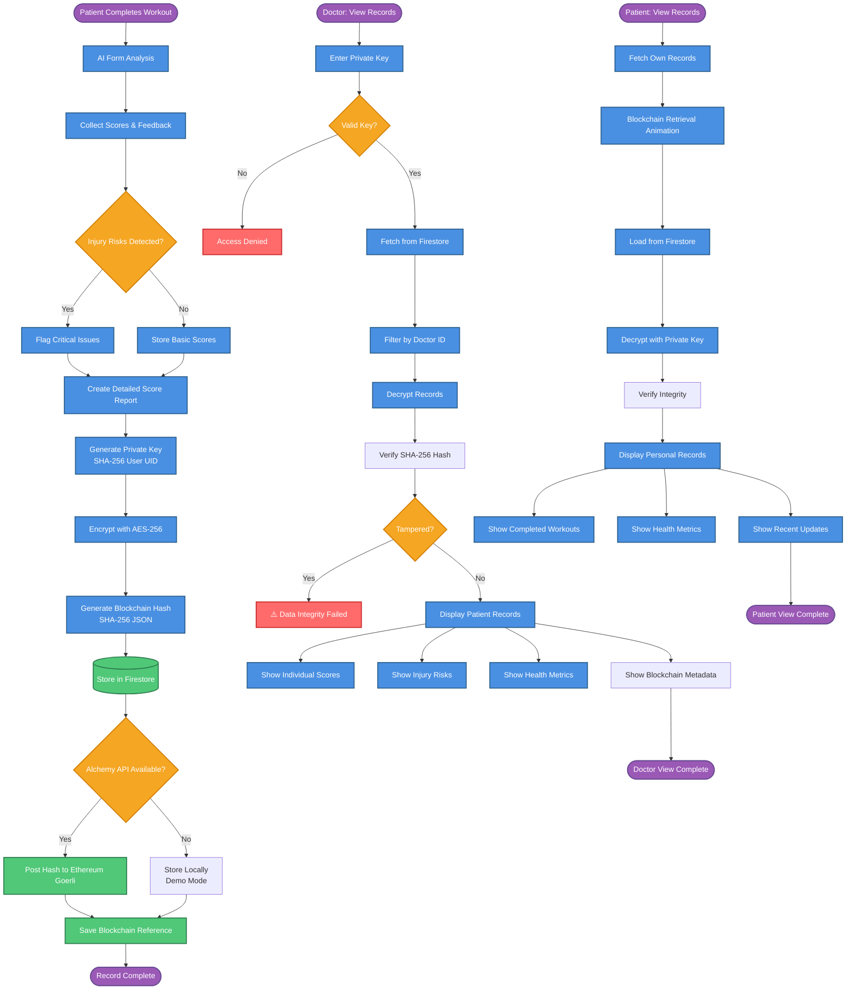

# Blockchain Secure Patient Records - System Flow

## System Components

### Key Processes
- **AES-256 Encryption**: Symmetric encryption algorithm
- **SHA-256 Hashing**: Cryptographic integrity verification
- **Private Key Generation**: User-specific key derivation
- **Blockchain Storage**: Ethereum Goerli testnet integration

### Decision Points
- **Injury Risk Detection**: Checks for critical form issues
- **API Availability**: Fallback to demo mode if unavailable
- **Authentication**: Doctor private key validation
- **Data Integrity**: Hash verification against tampering

### Data Storage
- **Firestore**: Primary encrypted data storage
- **Blockchain Testnet**: Immutable hash verification
- **Local Storage**: Demo mode fallback

---

## Visual Legend

- **Blue Boxes**: Processing steps
- **Yellow Diamonds**: Decision points
- **Green Cylinders**: Data storage
- **Red Boxes**: Error states
- **Purple Ovals**: Start/End points

