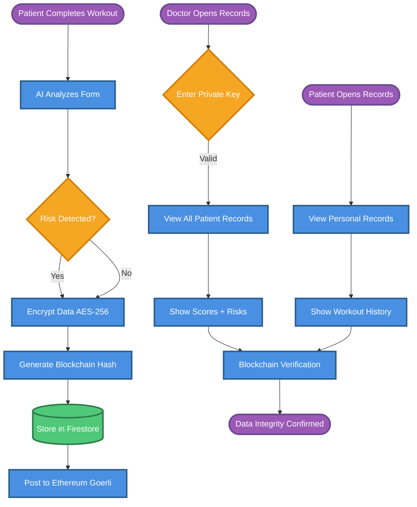

# Blockchain Secure Patient Records - Simplified Flow

## Key Components

1. **Patient Workout** → Form analysis with AI
2. **Risk Detection** → Flags injury concerns
3. **Encryption** → AES-256 for privacy
4. **Blockchain Hash** → SHA-256 for integrity
5. **Firestore Storage** → Secure database
6. **Ethereum Goerli** → Immutable verification
7. **Doctor Access** → Private key required
8. **Patient Access** → Direct view
9. **Verification** → Anti-tampering checks

