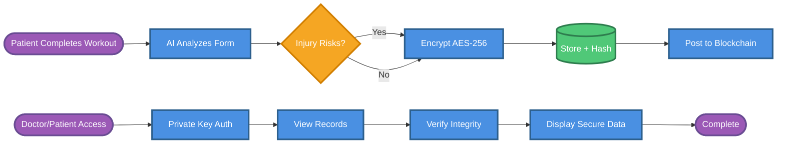

# Blockchain Secure Patient Records - Presentation Flow (12 Elements)

```mermaid
flowchart LR
    Start([Patient Completes Workout]) --> AI[AI Analyzes Form]
    AI --> Risk{Injury Risks?}
    Risk -->|Yes| Encrypt[Encrypt AES-256]
    Risk -->|No| Encrypt
    Encrypt --> Store[(Store + Hash)]
    Store --> BC[Post to Blockchain]
    
    Access([Doctor/Patient Access]) --> Auth[Private Key Auth]
    Auth --> View[View Records]
    View --> Verify[Verify Integrity]
    Verify --> Show[Display Secure Data]
    Show --> End([Complete])
    
    %% Styling
    classDef main fill:#4A90E2,stroke:#2C5F8D,stroke-width:3px,color:#fff
    classDef decision fill:#F5A623,stroke:#D17E00,stroke-width:3px,color:#fff
    classDef store fill:#50C878,stroke:#2E7D4E,stroke-width:3px,color:#fff
    classDef start fill:#9B59B6,stroke:#6A4C93,stroke-width:3px,color:#fff
    
    class AI,Encrypt,BC,Auth,View,Verify,Show main
    class Risk decision
    class Store store
    class Start,Access,End start
```

