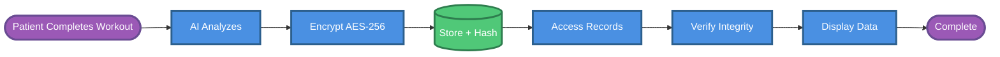

# Blockchain Secure Patient Records - Presentation Flow (10 Elements)

```mermaid
flowchart LR
    Start([Patient Completes Workout]) --> AI[AI Analyzes]
    AI --> Encrypt[Encrypt AES-256]
    Encrypt --> Store[(Store + Hash)]
    Store --> Access[Access Records]
    Access --> Verify[Verify Integrity]
    Verify --> Show[Display Data]
    Show --> End([Complete])
    
    %% Styling
    classDef main fill:#4A90E2,stroke:#2C5F8D,stroke-width:3px,color:#fff
    classDef store fill:#50C878,stroke:#2E7D4E,stroke-width:3px,color:#fff
    classDef start fill:#9B59B6,stroke:#6A4C93,stroke-width:3px,color:#fff
    
    class AI,Encrypt,Access,Verify,Show main
    class Store store
    class Start,End start
```

