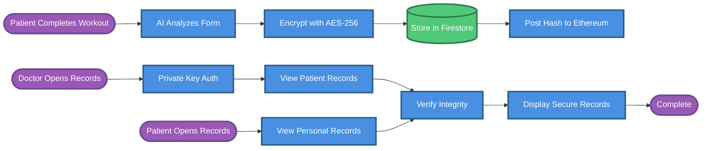

# Blockchain Secure Patient Records - Simplified Flow

## Simplified Flow (10 Elements)

1. **Patient Completes Workout** → Starting point
2. **AI Analyzes Form** → Automated analysis
3. **Encrypt with AES-256** → Privacy protection
4. **Store in Firestore** → Database storage
5. **Post Hash to Ethereum** → Blockchain integrity
6. **Doctor Opens Records** → Requires authentication
7. **Patient Opens Records** → Direct access
8. **Verify Integrity** → Anti-tampering check
9. **Display Secure Records** → User view
10. **Complete** → End state

