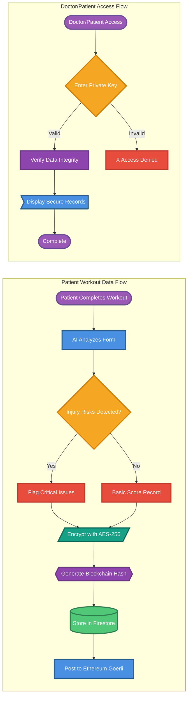

# Blockchain Secure Patient Records - Wide Format Flow

```mermaid
flowchart LR
    subgraph PatientFlow["Patient Workout Data Flow"]
        Start([Patient Completes Workout]) --> AI[AI Analyzes Form]
        AI --> Risk{Injury Risks Detected?}
        Risk -->|Yes| FlagRisks[Flag Critical Issues]
        Risk -->|No| Basic[Basic Score Record]
        FlagRisks --> Encrypt[/Encrypt with AES-256/]
        Basic --> Encrypt
        Encrypt --> Hash{{Generate Blockchain Hash}}
        Hash --> Store[(Store in Firestore)]
        Store --> BC[Post to Ethereum Goerli]
    end
    
    subgraph AccessFlow["Doctor/Patient Access Flow"]
        AccessStart([Doctor/Patient Access]) --> Auth{Enter Private Key}
        Auth -->|Valid| Verify[Verify Data Integrity]
        Auth -->|Invalid| Deny[X Access Denied]
        Verify --> Display>Display Secure Records]
        Display --> End([Complete])
    end
    
    %% Styling with varied colors
    classDef main fill:#4A90E2,stroke:#2C5F8D,stroke-width:3px,color:#fff
    classDef decision fill:#F5A623,stroke:#D17E00,stroke-width:3px,color:#fff
    classDef store fill:#50C878,stroke:#2E7D4E,stroke-width:3px,color:#fff
    classDef start fill:#9B59B6,stroke:#6A4C93,stroke-width:3px,color:#fff
    classDef highlight fill:#E74C3C,stroke:#C0392B,stroke-width:3px,color:#fff
    classDef process fill:#16A085,stroke:#0E6655,stroke-width:3px,color:#fff
    classDef verify fill:#8E44AD,stroke:#6C3483,stroke-width:3px,color:#fff
    
    class AI,BC,Display main
    class Risk,Auth decision
    class Store store
    class Start,AccessStart,End start
    class FlagRisks,Basic highlight
    class Encrypt process
    class Hash,Verify verify
    class Deny highlight
```

