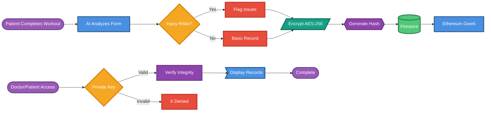

# Blockchain Secure Patient Records - Wide Format Flow



## How to Download the Image

### Option 1: Mermaid Live Editor (Recommended - Easiest)
1. Go to https://mermaid.live/
2. Copy and paste the Mermaid code (everything between the ```mermaid and ``` markers)
3. The diagram will render automatically
4. Click the **"Actions"** button (top right)
5. Select **"Download PNG"** or **"Download SVG"**

### Option 2: Using Mermaid CLI (Command Line)
If you have Node.js installed:
```bash
npm install -g @mermaid-js/mermaid-cli
mmdc -i BLOCKCHAIN_FLOWCHART_WIDE.md -o blockchain_flowchart.png -b transparent
```

### Option 3: GitHub Rendering + Screenshot
1. View the file on GitHub: https://github.com/majidsafwaan2/gymguard/blob/main/BLOCKCHAIN_FLOWCHART_WIDE.md
2. The diagram will render automatically on GitHub
3. Take a screenshot of the rendered diagram

### Option 4: VS Code Extension
1. Install the "Markdown Preview Mermaid Support" extension
2. Open the `.md` file in VS Code
3. Right-click the rendered diagram
4. Select "Copy Image" or "Save Image"

