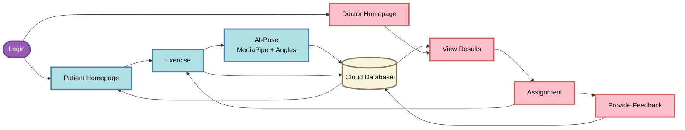

# Theravive System Architecture Flowchart

## Link Color Legend

- **Solid arrows** (`-->`): Primary flows (Assignments, Results, Feedback)
- **Dashed arrows** (`-.->`): Session data/metrics flow (Blue)
- **Thick arrows** (`==>`): Model outputs - Landmarks/Angles (Orange)
- **Dotted from Cloud** (`-.->`): Feedback Summary flow (Green)

## Flow Description

1. **Login** branches to Patient Homepage (teal) or Doctor Homepage (pink)
2. **Patient Lane (Teal)**:
   - Settings and Exercise options
   - Exercise → AI-Pose Module (MediaPipe + angle tracking)
   - Both send session data/metrics to Cloud Database
   - Receives summarized Doctor Feedback

3. **Doctor Lane (Pink)**:
   - Patient List → View Test Results → Assignment → Provide Feedback
   - Reads results from Cloud Database
   - Sends new Assignments and Feedback to Cloud

4. **Cloud Database Cluster**:
   - Stores all session data/metrics
   - Runs AI-Evaluation Model
   - Routes feedback between doctor and patient

5. **Cross-Lane Flow**: Assignment from Doctor directly links to Patient's Exercise

